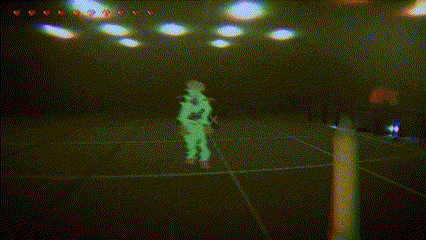
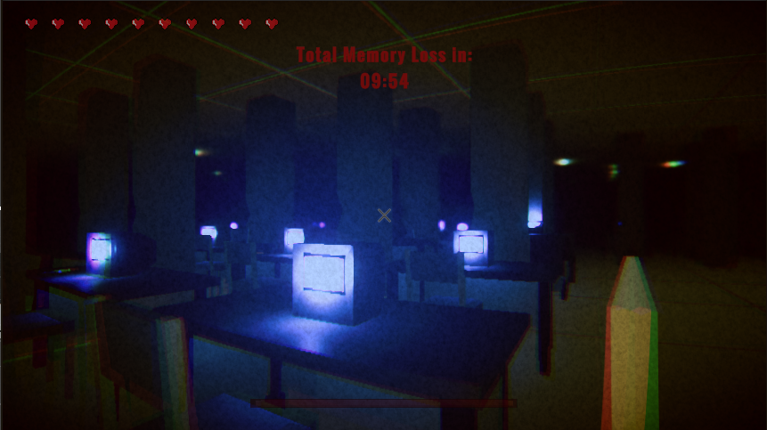
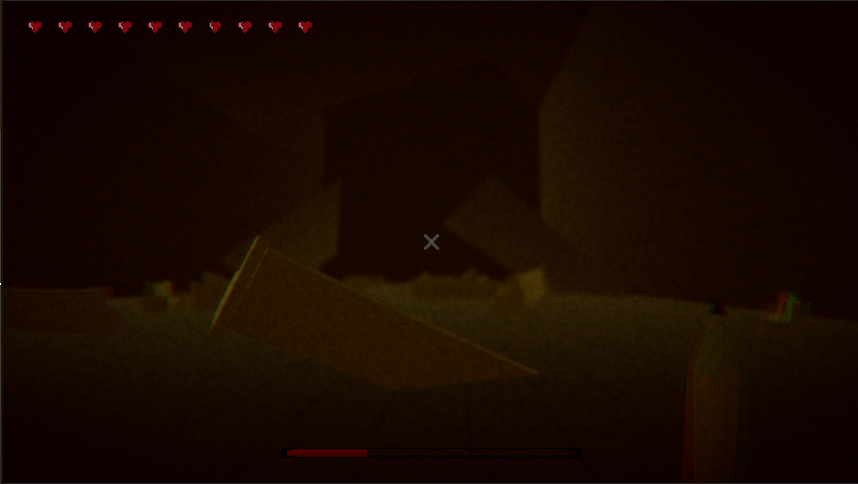

# Project 2 Report

## Table of Contents

- [Evaluation Plan](#evaluation-plan)
- [Evaluation Report](#evaluation-report)
- [Shaders and Special Effects](#shaders-and-special-effects)
- [Summary of Contributions](#summary-of-contributions)
- [References and External Resources](#references-and-external-resources)

## Evaluation Plan

### 1. Evaluation Techniques:
We will use a combination of querying and observational techniques to evaluate the usability of our game. The primary techniques will include:

#### Post-Study System Usability Questionnaire (PSSUQ):
- Overall, I am satisfied with how easy it is to use this system. (Usefulness)
- It was simple to use this system. (Usefulness)
- I was able to complete the tasks and scenarios quickly using this system. (Usefulness)
- I felt comfortable using this system. (Usefulness)
- It was easy to learn to use this system. (Usefulness)
- I believe I could become productive quickly using this system. (Usefulness)
- The system gave error messages that clearly told me how to fix problems. (Information Quality)
- Whenever I made a mistake using the system, I could recover easily and quickly. (Information Quality)
- The information (such as online help, on-screen messages, and other documentation) provided with this system was clear. (Information Quality)
- It was easy to find the information I needed. (Information Quality)
- The information was effective in helping me complete the tasks & scenarios. (Information Quality)
- The organization of information on the system screens was clear. (Information Quality)
- The interface of this system was pleasant. (Interface Quality)
- I liked using the interface of this system. (Interface Quality)
- This system has all the functions and capabilities I expect it to have. (Interface Quality)
- Overall, I am satisfied with this system. (Interface Quality)

#### System Usability Scale (SUS):
To complement the PSSUQ, we will also use SUS with a different group of participants. It consists of 10 questions, measured on a 5-point Likert Scale ranging from Strongly Disagree to Strongly Agree. 
1. I think that I would like to use this system frequently.
2. I found the system unnecessarily complex.
3. I thought the system was easy to use.
4. I think that I would need the support of a technical person to be able to use this system.
5. I found the various functions in this system were well integrated.
6. I thought there was too much inconsistency in this system.
7. I would imagine that most people would learn to use this system very quickly.
8. I found the system very cumbersome to use.
9. I felt very confident using the system.
10. I needed to learn a lot of things before I could get going with this system.

**Scoring:**
- Odd-numbered questions (1, 3, 5, 7, 9) reflect positive aspects of usability. To score these,we need to subtract 1 from the user's response.
- Even-numbered questions (2, 4, 6, 8, 10) reflect negative aspects of usability. To score these, we need to subtract the user's response from 5.
- Sum the scores for all 10 questions to get a number between 0 and 40. We need to multiply this sum by 2.5 to convert it into a score out of 100.

#### Observational Evaluation:
We will observe participants as they interact with the game, noting any difficulties they encounter, such as confusion with controls, tasks, or UI elements, and also assess areas where they get stuck or might need our help to understand how to proceed. We will use this to assess real-time user experience and identify areas of improvement in gameplay.

### 2. Tasks for Participants:
We will ask participants to perform specific tasks when they’re playing the game so they will know what to focus on and it will make it more effective in answering questions.
- **Complete the First Level:** Ask them to take a break after completing level 1, and ensure they’re understanding the story of the game as they go forward. See if they have any questions, and try to find solutions so that other users might not face the same difficulties.
- **Defeat an Enemy:** This will evaluate how well the player can use game mechanics for combat.
- **Fight the Boss:** Different players may lose/win which will help us get different points of view on how they felt during/after the final fight.

### 3. Participants:
We will recruit 10 or more participants:
- **Group 1:** Will complete the PSSUQ and be observed while performing the tasks.
- **Group 2:** Will complete the SUS and be observed while performing the tasks.

#### Recruitment Strategy:
Participants will be recruited from the target audience for the game (e.g., those who love to be immersed in a fantastical yet eerie and confusing environment). Participants will be recruited based on a basic knowledge of:
- Basic gaming experience (at least familiar with WASD controls and mouse for navigation).
- Aged 16 years or older to align with the target demographic.
We will recruit participants using social media platforms, gaming communities, and university forums.

### 4. Data Collection:
- **PSSUQ and SUS:** After completing the tasks, participants will be asked to fill out the PSSUQ and SUS questionnaires, rating each item on a scale. We will be using Microsoft Forms to collect data from the participants to ensure that the data formal is the same for each participant and can be analysed properly after collection. 
- **Observational Data:** We will use video recording and note-taking (based on consent from the player) to document interactions with the game, focusing on:
  - Time taken to complete tasks.
  - Areas where participants get stuck or express frustration.
  - Verbal feedback during gameplay to capture spontaneous reactions.
  - Post-game general question about what they thought about the game, and get an idea of what they think the areas of improvement are.

### 5. Data Analysis:
- **PSSUQ Analysis:** We will calculate the average scores for each of the three subscales (System Usefulness, Information Quality, and Interface Quality) and overall usability. Each participant’s scores will be aggregated, and we will look for trends in the data.
- **SUS Analysis:** The SUS responses will be converted into a usability score for each participant. The SUS score will range from 0 to 100, with a higher score indicating better usability.
- **Observational Data:** We will analyze the recorded gameplay to identify recurring issues, challenges with controls, and frustration points. Specific metrics include:
  - **Task Completion Rate:** Percentage of participants who successfully completed each task.
  - **Task Completion Time:** Average time taken to complete tasks.
  - **Error Rate:** Number of times participants made errors while interacting with the game (e.g., wrong keys, confusion with mechanics).
  - **Observational Notes:** Identify any non-verbal cues indicating confusion, frustration, or ease.

### 6. Timeline:
- **Week 1 (7th to 14th October):** Recruit participants and finalize the evaluation tasks.
- **Week 2 (15th to 21st October):** Conduct the evaluation with the participants.
- **Week 3 (21st to 29th October):** Analyze the data and make the necessary changes.

### 7. Responsibilities:
We will divide the responsibilities for working on the evaluation plan accordingly: Three people will be responsible for recruiting participants and collecting data while one person will be analysing the data found. After analysis, the team will work together to ensure that the game is modified according to the feedback received.

## Evaluation Report

TODO (due milestone 3) - see specification for details

## Shaders and Special Effects

### [GlitchShader.shader](Assets\Shaders\GlitchShader.shader)

The GlitchShader was designed to create a glitchy effect for NPCs by simulating visual artifacts normally found in old TVs.
- Randomly offsets the RGB channels of its texture over time to create a disjointed, glitchy appearance
- Randomly offsets the x vertices to create a stretching and deforming effect
- Has a random chance to discard all pixels, creating a flickering effect, just like a broken TV
- Overlays the result with black bars using dithering, just like CRTs have
- Enables GPU instancing, which in conjunction with [Glitch.cs](Assets/Scripts/Shaders/Glitch.cs) can create a glitchy afterimage effect by randomly displacing instances around the NPC.

It has several different properties for fine-tuning:
- **_Texture**: for the texture to be given to the shader
- **_GlitchIntensity**: control how violently the colour and x-coordinate vertexes oscillate
- **_GlitchSpeed**: control how often the offsets occur
- **_DitherAmount**: control how thick the black bars created by the dithering are

### [BossShader.shader](Assets\Shaders\BossShader.shader)

The BossShader was designed to create a uniquely creepy visual effect for the boss, continuing the glitchy and incorrect feeling of the game.
- Pulsates with a given colour (recommended to use red) to create a dangerous and frightening feeling
- The texture is fixed to its screen position and does not change on camera position nor angle, giving a unique 'portal' or 'god'-like effect
- The texture is randomly and slightly distorted by stretching and offsetting it based on its world position
- The texture's red and blue colour channels are also randomly and slightly offset, creating a chromatic aberration effect
- The transparency is increased to increase the 'ethereal' feeling, as if it is transitioning between worlds
- This shader can be enhanced through the use of [RandomTexture.cs](Assets/Scripts/Shaders/RandomTexture.cs), a script that randomly changes the texture of the shader over time to create a more strange and chaotic effect.

It has several different properties for fine-tuning:
- **_Texture**: for the texture to be given to the shader
- **_TextureSize**: tweak the size of the texture used
- **_Alpha**: control the level of transparency
- **_GlowColour**: for the colour the shader will pulsate with
- **_GlowIntensity**: control how brightly the colour glows
- **_PulseSpeed**: control how quickly the shader pulsates its glowing effect
- **_ChromaticAberrationOffset**: control how much the texture should offset its red and blue channels
- **_TextureStretch**: control how much the texture should be stretched
- **_TextureOffset**: control how much the texture should be offset

> It should be noted that the pseudo random number generator and the dithering calculation function used throughout were taken from the Unity docs, and so have been referenced appropriately. They should not be marked as part of our group's work.

### [BloodParticleSystem.prefab](Assets/Prefabs/ParticleSystems/Blood%20Particle%20System/Blood%20System.prefab)

The blood particle system was implemented to create a blood splatter effect when enemies are damaged. A high quantity of particles (rate of 100-200 over time) are emitted in a looping state to exaggerate the enemy damage. They are sized randomly within a small range (0.05-0.15) yet their velocities can range quite widely (3-8), to give more of a sputtering blood effect.

Furthering this effect are the two emission bursts. One has a high change chance of 50% of spawning, with a small clump of 100 particles, and the other has a small chance of 10% with a large clump of 400 particles. These two bursts respectively give the effect of the heart pumping blood and a blood clot being overcome or an artery being hit.

The colour of the particles darkens from a bright red to a dark sickly red over time, aging just like normal blood does, just with again a much more exaggerated time frame. The size of the particles reduces over time for the same reason.

To make it seems like the blood is squirting from the wound, trails are used to fill in the space behind the blood. Enhancing this effect is a sub emitter that is attached to the particle system's prefab and simply inherits the blood's velocity and drops down, giving a dripping effect. It has a high chance of 75% to spawn with a particle.

This particle system only plays when the enemy is hit, and then stops after a short time (3 seconds), to prevent the game from becoming too bloody and to prevent performance issues.

### [PostProcessing.prefab](Assets/Prefabs/PostProcessing/PostProcessing.prefab)

Using Unity's Global Volume, multiple effects were applied to enhance the feeling of looking through an old CRT as well as increasing the visual quality of the game and creating a more eerie atmosphere for the player.

- **Panini Projection:** Creates a fisheye 'CRT-like' effect that distorts the edges of the screen
- **Film Grain:** Adds a subtle grainy effect to the screen, just like old movies
- **Vignette:** Darkens the edges of the screen and makes the game feel more gloomy
- **Chromatic Aberration:** Creates a glitchy effect by separating the RGB channels slightly around the edges of the screen
- **Bloom:** Enhances the brightness of lights and emissive materials in effort to increase realism
- **Shadows Midtones Highlights:** Adjusts the colours of the game to increase blue tones and make the game feel more murky
- **Lens Distortion:** Again increases the fisheye look and enhances the CRT look
- **Depth of Field:** Makes the visible area feel larger and more immersive
- **Motion Blur:** Makes the gameplay feel more panicked and fast-paced
- **Tone Mapping:** Makes the colours and lights more realistic, using ACES
- **Lift Gamma Gain:** Gives the game a more sickly yellow hue
- **White Balance:** Increases the blue tones across the board, making the game again more sickly
- **Color Adjustments:** Reduces the saturation of the game, furthering the eerie atmosphere

## Summary of Contributions

### William Spongberg

*Team Leader, World Generation, Shaders, Lighting, Post Processing, Particle Systems*

- Managed the project and coordinated the team AlphaBeta.
- Created the initial project structure and set up the Unity project.
- Using Blender, created from scratch 3D models for the desk and CRT monitor, and then implemented them into prefabs with appropriate materials.
- Developed, designed and implemented procedural world generation for an infinite office space using Perlin noise. Created all related scripts and prefabs.
- Post processing effects using Unity's built-in Global Volume to drastically enhance the visual quality of the game and its "eerie" atmosphere.
- Various bug fixes for known issues in the project. See Git commits for more details.
- Particle systems for the muzzle flash and blood effects.
- FreeCam prefab, a smooth free-look camera system akin to the camera used in Scene view that was used for the game's trailer.
- ObjectSpawner, a script that spawns objects randomly within a given range of the player.
- Initial very basic enemy AI using NavMesh and NavMeshAgent that just pathfinds to the player.
- Automatic NavMesh baking around the player to ensure that enemies can navigate the environment.
- Repeatedly tweaked procedural world gen and AI baking to ensure the game performs well.
- Ragdoll physics for enemies.
- GlitchShader.shader, a shader that creates a complex 'glitchy' effect for the NPCs using gpu instancing, dithering and random offsets of the UVs and x coordinates.
- Glitch.cs, a script for GlitchShader.shader that adds and rotates gpu instances randomly within a short range of the prefab its attached to to create a distorted, glitchy effect.
- BossShader.shader, a shader that creates a menacing 'boss' effect using a fixed-screen texture, chromatic aberration and a red pulsating glow.
- Added GameOver screen on player death
- Numerous other small scripts and tweaks to improve the game's performance, visual quality, and overall experience.
---
### Alistair Cheah Wern Hao

*Movement, AI/Enemies, Weapons, Audio, UI, Boss*

Mechanics/Movement

- Developed the first-person camera system using Cinemachine’s virtual camera for responsive mouse movement.
- Implemented direct transformation-based player movement to enable snappy FPS movement while retaining physics interactions,
  resolving prior slippery controls.
- Added sprint functionality based on stamina.
- Implemented player health system for taking damage and healing.

Weapons/Audio

- Created three weapon types: melee, pistol, and shotgun, each with unique mechanics.
- Developed an attack controller script to enable switching between different weapons.
- Synced weapon movement with vertical player head motion for a cohesive FPS experience.
- Implemented recoil for guns and basic animation for melee attacks.
- Designed a weapon unlock system, allowing players to pick up and drop new weapons during gameplay.
- Set up a range of audio cues for weapons, including firing, reloading, arming, empty magazine alerts, etc.
  Unique variations of each sound were also included for added realism.
- Added grunts for players/enemies upon taking damage.

Enemy AIs

- Implemented an enemy AI state machine for dynamic behavior, switching between patrolling, chasing, and attacking
  based on player proximity and other triggers.
- Developed two enemy types:
    Shooting enemy: Charges a bullet before release.
    Charging enemy: Damages on collision and retreats post-attack.
- Created bullets to damage/kill the player and enemies.
- Added spatial audio for player and enemy footsteps to enhance immersion and realism.

UI/Gameplay

- Reworked the pause manager for working transitions between pause menu, main menu, settings, and instructions.
- Redesigned the settings screen to properly adjust mouse sensitivity and field of view (FOV) based on the cinemachine camera.
- Implemented instructional pages to guide users through game controls.
- Created a HUD for the player including:
    A crosshair for aiming precision.
    A countdown timer that is displayed throughout the game.
    A health bar represented by heart images.
    A sprint slider that fades in/out to indicate remaining stamina
    A text box indicating ammo count/reloading.
- Remodelled the elevator, from a platform to an open elevator with a trigger inside to detect the player
  and allow the player to rise through the ceiling with a fading panel cue.

Boss
- Developed boss movement along predefined waypoints.
- Designed boss attack mechanics, dropping of explosives.
- Implemented a boss health system and health bar.
- Reworked the object spawner to spawn the final boss.
- Baked the mesh surface for the boss level

---

### David Kee Siong Chin

*Story, Boss*

 - TODO
---
### Ananya Agarwal

*User Evaluation*

 - TODO

## References and External Resources

### Assets
- [Synty student bundle](https://assetstore.unity.com/student-plan-pack1): For various low-poly 3D models, textures, and materials.
- [Unity Starter Assets](https://assetstore.unity.com/packages/essentials/starter-assets-thirdperson-updates-in-new-charactercontroller-pa-196526): For NPC movement animations and environment materials.

### Resources
- TODO (e.g tutorials etc)
